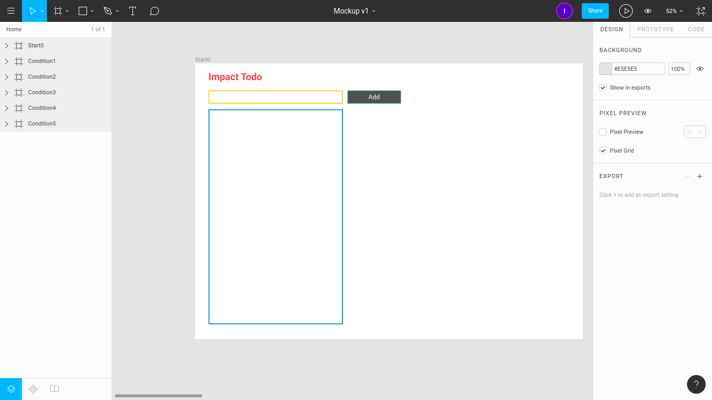
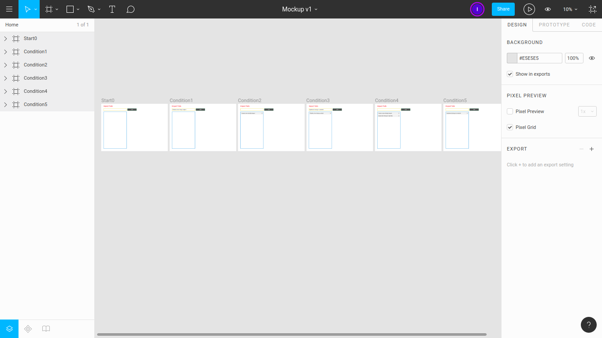
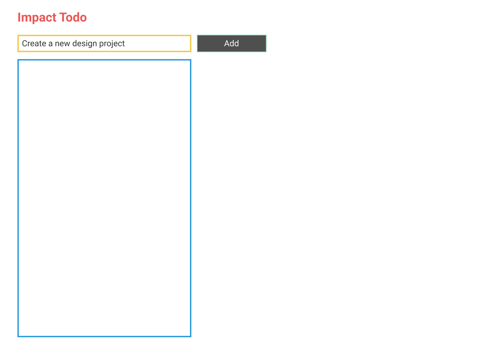
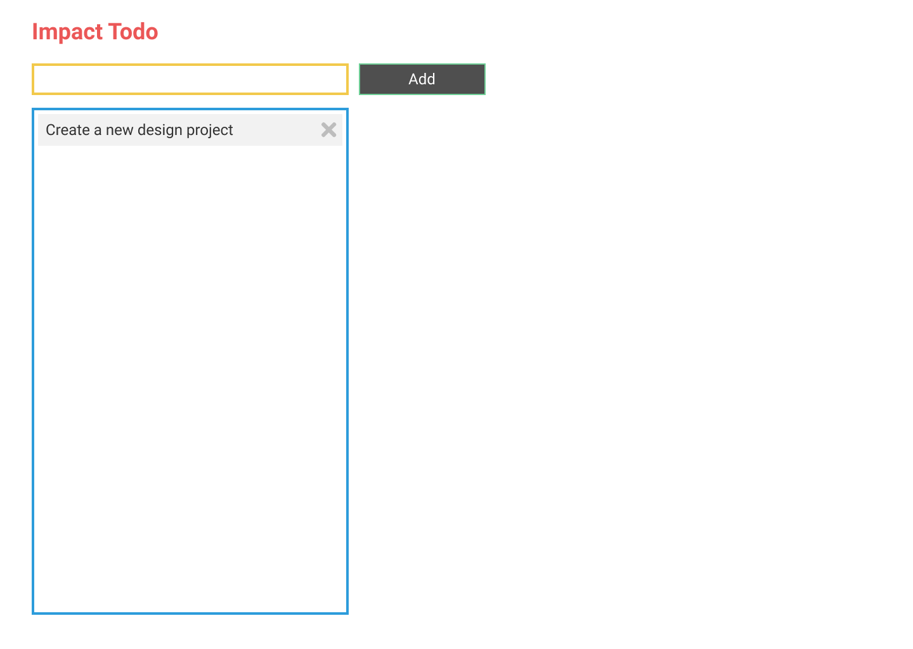
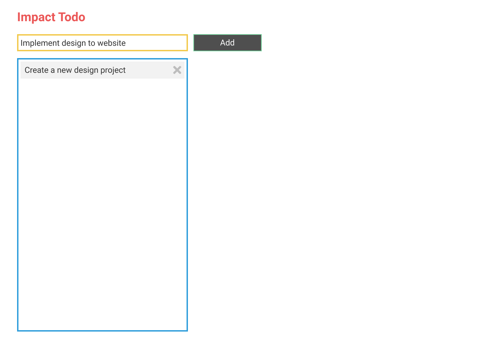
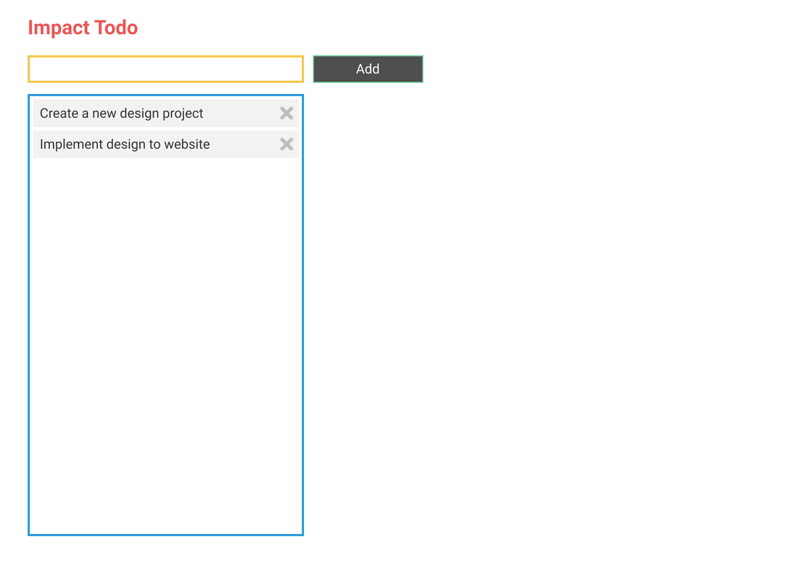

# [Impact Todo](https://github.com/impactbyte-learn/code-impactodo)

Impact Todo is a simple todo app that can:

* Create todo
* Read todo
* Delete todo

---

## App

### Live on the Internet

Visit [Impact Todo](https://impactodo.netlify.com).

### Run locally

Open `index.html` file on your web browser.

---

## Design on Figma

* Inspiration from [TodoMVC](http://todomvc.com)
* Visit [Mockup v1](https://www.figma.com/file/ID5EGTB6c4ARMn2CwfRe3AL1/Mockup-v1)
* Visit [Interactive Prototype v1](https://www.figma.com/proto/ID5EGTB6c4ARMn2CwfRe3AL1/Mockup-v1)

---

## Application Features

Basic:

* Create todo
* Read one or all todos
* Update todo (edit text, complete todo)
* Delete one or all todo

Intermediate:

* Search todos
* Filter todos
* Paginate todos
* Bookmark todo
* Print todos

Advanced:

* Register account
* Login account
* Logout account
* Comment on todo

Master:

* Verify email
* Forgot password
* Manage profile

Super:

* Sell and buy todo
* Shopping cart
* Process payment
* Analyze data

## Screenshots

**Figma Screen**

**Figma Frames**

**Start0**

**Condition1**

**Condition2**

**Condition3**

**Condition4**

**Condition5**

